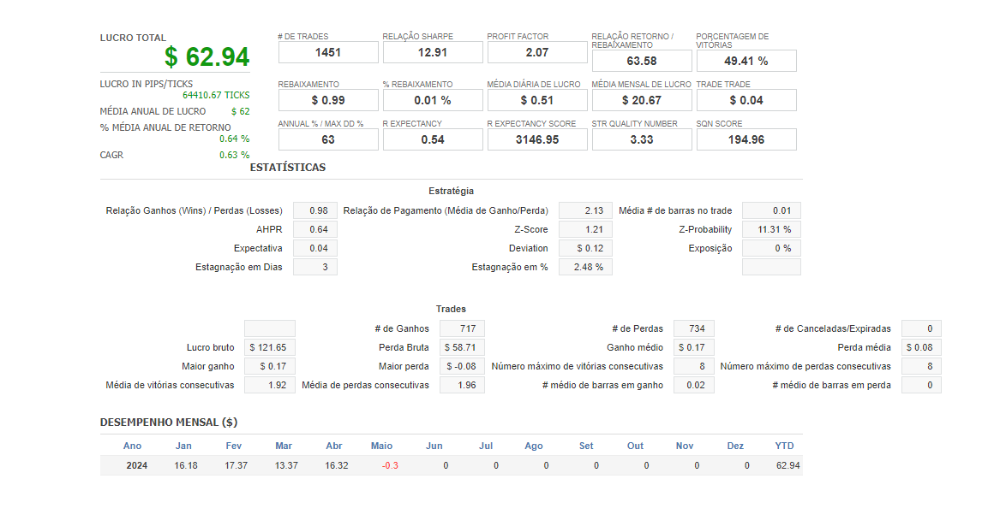

# EXA623 - FINANÇAS COMPUTACIONAIS
## Atividade 03 – Otimização

**Alunos:**
- Aurelio Barreto (aurelionadjabarreto@gmail.com)
- Kevin Cerqueira Gomes (kevingomes.uefs@gmail.com)

**Instituição:** Engenharia de Computação - Universidade Estadual de Feira de Santana (UEFS)

**Localização:** Caixa Postal 252 e 294 – 44.036-900 – Feira de Santana – BA – Brasil

#### Todos os arquivos que geramos e foram utilizados nesse documento (além de outros que não estão presentes neste documento) estão no drive: [abrir](https://drive.google.com/drive/folders/1AonerXn1zxsCgVBa-v0h_aoDc_F9dzym?usp=drive_link)

## Diário (Swing Trade) - Símbolo escolhido: EURUSD Forex

- CFX do SQX: [abrir](https://drive.google.com/file/d/1HN0iN5beHbDQftcSZYP4UGDAot4U5CVF/view?usp=drive_link)

### Otimização Simples

#### EA1

- Visão Geral:

- Perfil de Otimização

- Sistema de Permutação de Paramêtros:

#### EA2

- Visão Geral:

- Perfil de Otimização

- Sistema de Permutação de Paramêtros:

### Otimização Sequencial

#### EA1

- Visão Geral:

- Resultados

#### EA2

- Visão Geral:

- Resultados

### Otimização Walk Forward

#### EA1

- Resultados Walk Forward:

- Visão Geral:

- Perfil de Otimização

- Sistema de Permutação de Paramêtros:

#### EA2

- Resultados Walk Forward:

- Visão Geral:

- Perfil de Otimização

- Sistema de Permutação de Paramêtros:

### Otimização Matrix Walk Forward

#### EA1

- Lista de trade: [abrir](https://docs.google.com/spreadsheets/d/19hNEeRvqq9EcPxr1T4recWoOb-LVT-WI/edit?usp=drive_link&ouid=104297309265572510054&rtpof=true&sd=true)
- Código fonte: [abrir](https://drive.google.com/file/d/121UydTA5DMcPvVKSIsgMG4y6AfBnT5Gx/view?usp=drive_link)
- Código fonte importado e compilado no MetaTrader:

- Resultados Matrix Walk Forward:

- Visão Geral:

- Perfil de Otimização

- Sistema de Permutação de Paramêtros:

#### EA2

- Lista de trade: [abrir](https://docs.google.com/spreadsheets/d/1gfE47USzU9IDspIAaOt9M_P_m1AKGSH9/edit?usp=drive_link&ouid=104297309265572510054&rtpof=true&sd=true)
- Código fonte: [abrir](https://drive.google.com/file/d/1IITt74WxwgDDszoquVpZbFX4DWDSXkex/view?usp=drive_link)
- Código fonte importado e compilado no MetaTrader:

- Resultados Matrix Walk Forward:

- Visão Geral:

- Perfil de Otimização

- Sistema de Permutação de Paramêtros:

## Intraday (Day Trade) - Símbolo escolhido: BTCUSD Crypto

- CFX do SQX: [abrir](https://drive.google.com/file/d/1w7-o7AMkEFoJWCNrvQhf8oDElq-Sf9if/view?usp=drive_link)

### Otimização Simples

#### EA1

- Visão Geral:

- Perfil de Otimização

- Sistema de Permutação de Paramêtros:

#### EA2

- Visão Geral:

- Perfil de Otimização

- Sistema de Permutação de Paramêtros:

### Otimização Sequencial

#### EA1

- Visão Geral:

- Resultados

#### EA2

- Visão Geral:

- Resultados

### Otimização Walk Forward

#### EA1

- Resultados Walk Forward:

- Visão Geral:

- Perfil de Otimização

- Sistema de Permutação de Paramêtros:

#### EA2

- Resultados Walk Forward:

- Visão Geral:

- Perfil de Otimização

- Sistema de Permutação de Paramêtros:

### Otimização Matrix Walk Forward

#### EA1

- Lista de trade: [abrir](https://docs.google.com/spreadsheets/d/1xNMx5LyrAIPgL79ARf4JZHgXoZi5b2xZ/edit?usp=drive_link&ouid=104297309265572510054&rtpof=true&sd=true)
- Código fonte: [abrir](https://drive.google.com/file/d/134hDbOck6LjZ-bSCCyeOfD0FLtQ4uOyY/view?usp=drive_link)
- Código fonte importado e compilado no MetaTrader:

- Resultados Matrix Walk Forward:

- Visão Geral:

- Perfil de Otimização

- Sistema de Permutação de Paramêtros:

#### EA2

- Lista de trade: [abrir](https://docs.google.com/spreadsheets/d/1hrOE30AHBI0D0GO13BBYPyE1fKc4sl9B/edit?usp=drive_link&ouid=104297309265572510054&rtpof=true&sd=true)
- Código fonte: [abrir](https://drive.google.com/file/d/1auSHB339wHX7adW19M-mderWU0LaEPzD/view?usp=drive_link)
- Código fonte importado e compilado no MetaTrader:

- Resultados Matrix Walk Forward:

- Visão Geral:

- Perfil de Otimização

- Sistema de Permutação de Paramêtros:
