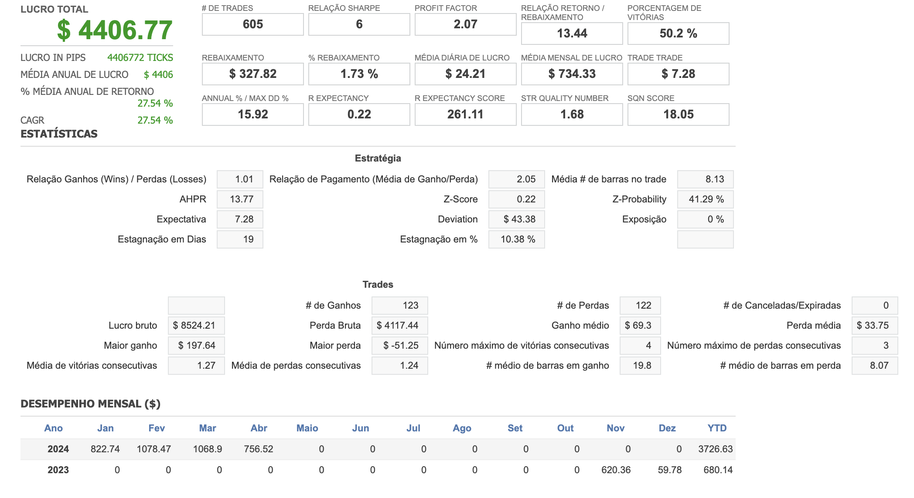
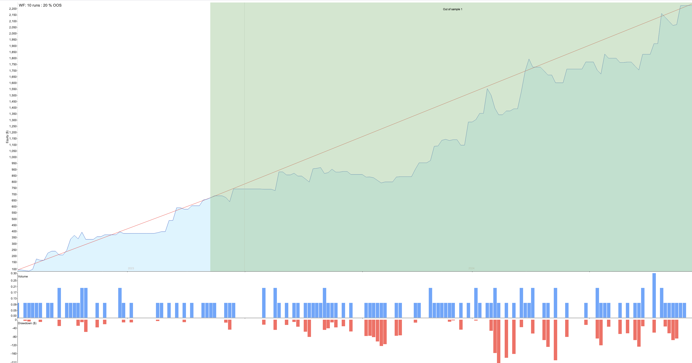
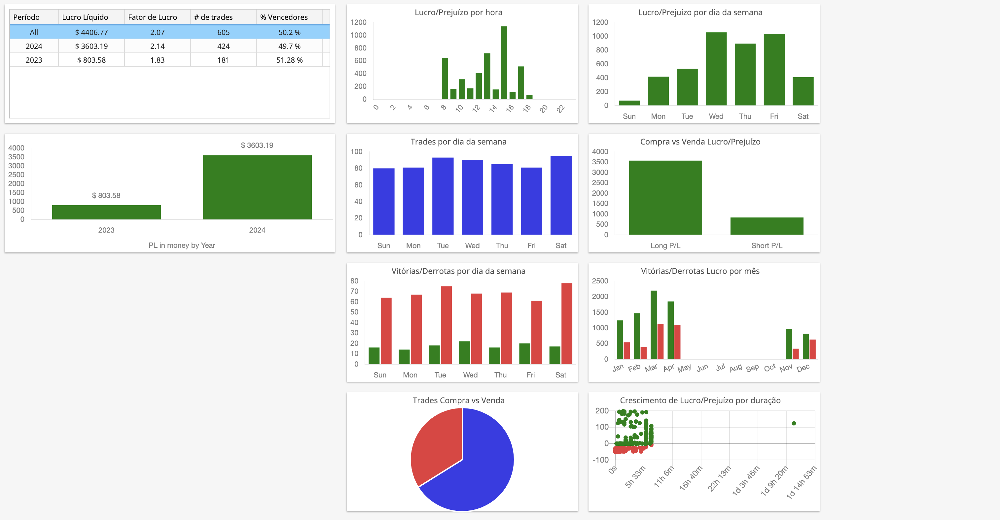

# EXA623 - FINANÇAS COMPUTACIONAIS
## Atividade 05 – Portfólios

**Alunos:**
- Aurelio Barreto (aurelionadjabarreto@gmail.com)
- Kevin Cerqueira Gomes (kevingomes.uefs@gmail.com)

**Instituição:** Engenharia de Computação - Universidade Estadual de Feira de Santana (UEFS)

**Localização:** Caixa Postal 252 e 294 – 44.036-900 – Feira de Santana – BA – Brasil

#### Todos os arquivos que geramos e foram utilizados nesse documento (além de outros que não estão presentes neste documento) estão no drive: [abrir](https://drive.google.com/drive/folders/1KRXqXB_K_fs7XEtJ4lud2wkLJy5UpxZb?usp=sharing)

### Os 10 índices escolhidos
| Symbol          | Name           | Category              | Timeframe | Source          | Date Range                |
|-----------------|----------------|-----------------------|-----------|-----------------|---------------------------|
| USDCNH          | Euro/Yuan      | Forex - Majors        | M1        | Dukascopy       | 02/05/2023 - 01/05/2024   |
| BTCUSD          | Bitcoin        | Crypto                | M1        | Dukascopy       | 08/05/2017 - 01/05/2024   |
| NASDAQ:AMZN     | Amazon         | Stocks - US           | D1        | SQ Equity data  | 03/01/2017 - 31/03/2022   |
| NASDAQ:GOOG     | Alphabet/Google| Stocks - US           | D1        | SQ Equity data  | 03/01/2017 - 31/03/2022   |
| NASDAQ:ADBE     | Adobe          | Stocks - US           | D1        | SQ Equity data  | 03/01/2017 - 31/03/2022   |
| DOLLARIDXUSD    | US Dollar Index| Indices - America     | M1        | Dukascopy       | 02/05/2020 - 01/05/2022   |
| RNOFREUR        | Renault SA     | Stocks - France       | M1        | Dukascopy       | 03/01/2017 - 31/03/2022   |
| GASCMDUSD       | Natural Gas    | Commodities - Energy  | M1        | Dukascopy       | 03/01/2017 - 31/03/2022   |
| CHIIDXUSD       | China A50      | Indices - Asia/Pacific| M1        | Dukascopy       | 03/01/2017 - 31/03/2022   |
| SOYBEANCMDUSX   | Soybean        | Commodities - Soft    | M1        | Dukascopy       | 02/05/2019 - 01/05/2023   |

### Portfolio Master

- Portfolio gerado: [abrir](https://drive.google.com/file/d/1KRyV8JgL8xMSHjicYXBKNq5qY0QCl7Cf/view?usp=drive_link)
- Stratégia mesclada: [abrir](https://drive.google.com/file/d/11BSTqmmMAmUB1maxPcBrPTHOv9bPeiVg/view?usp=drive_link)
- Lista de trades: [abrir](https://drive.google.com/file/d/1doI4EDeRAqmCAoYQoHypJF8ks5INLO0F/view?usp=drive_link)
- Código fonte: [abrir](https://drive.google.com/file/d/1ilwbNZhc-DHTZOMEPemPa6mg2cqDcLlT/view?usp=drive_link)

### Gráficos do Portfolio gerado:
- Visão Geral: 
- Gráfico de Capital: 
- Analise de Negociação: 

