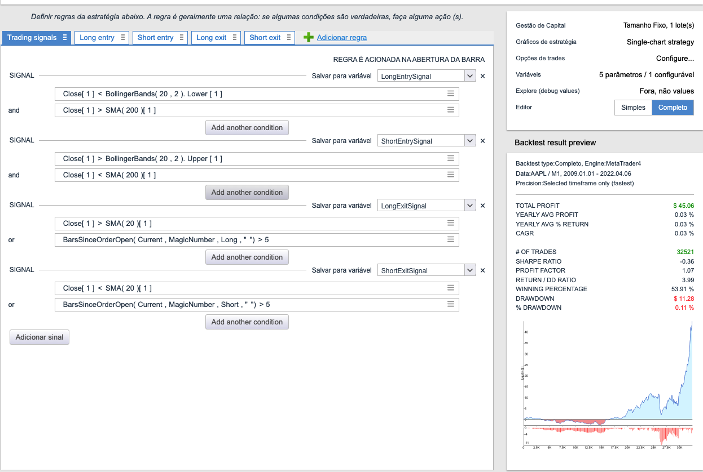
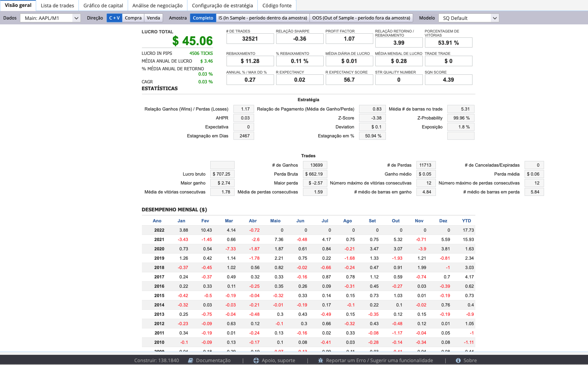
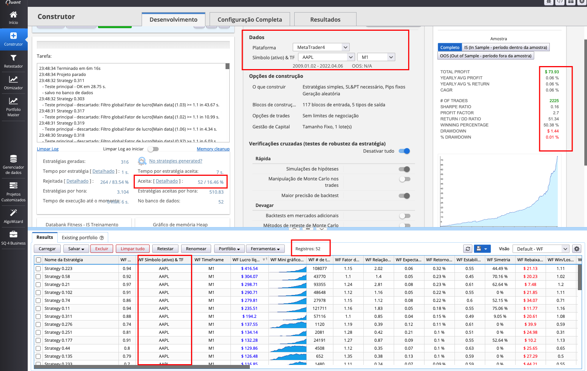

# EXA623 - FINANÇAS COMPUTACIONAIS
## Atividade 07 – Desenvolvimento de estratégia e template

**Alunos:**
- Aurelio Barreto (aurelionadjabarreto@gmail.com)
- Kevin Cerqueira Gomes (kevingomes.uefs@gmail.com)

**Instituição:** Engenharia de Computação - Universidade Estadual de Feira de Santana (UEFS)

**Localização:** Caixa Postal 252 e 294 – 44.036-900 – Feira de Santana – BA – Brasil

#### Todos os arquivos que geramos e foram utilizados nesse documento (além de outros que não estão presentes neste documento) estão no drive: [abrir](https://drive.google.com/drive/folders/10dT96jObO7KiZybnaHFPdEv9_pD6KDWN?usp=sharing)

# AlgoWizard
- Configuração do AlgoWizard: [abrir](https://drive.google.com/file/d/1mnhMjlb0jO6LhY6umL2t-JWJSwKNIZCu/view?usp=drive_link)
- Tela do backtest feito no AlgoWizard: 
- Aba Visão Geral do AlgoWizard: 

# Construtor (Builder)
- Configuração do Construtor feito pelo template gerado pelo AlgoWizard: [abrir](https://drive.google.com/file/d/11Hb563RdXKDt9s9y4--iucQmWp3Of8Li/view?usp=drive_link)
- Todas as 52 estratégias geradas exportadas como banco de dados (csv): [abrir](https://drive.google.com/file/d/1PLA6fExBUUZJ3eLOykqrJjMkbY_W0Wd1/view?usp=drive_link)
- Tela principal do Construtor após executar: 

# Lógica de Negociação com Indicadores Usados na Configuração

## Indicadores Utilizados:
1. **Bandas de Bollinger (20, 2)**
   - Parâmetros: período de 20, desvio padrão de 2
2. **Média Móvel Simples (SMA)**
   - Parâmetros: períodos de 200 e 20
3. **Close** (Fechamento)
   - Preço de fechamento da barra

## Regras de Entrada:

1. **Long Entry (Entrada Longa):**
   - **Condição 1:**
     - **Close[1] < BollingerBands(20, 2).Lower[1]**: O preço de fechamento da barra atual é menor que a banda inferior das Bandas de Bollinger.
     - **Close[1] < SMA(200)[1]**: O preço de fechamento da barra atual é menor que a Média Móvel Simples de 200 períodos.
   - **Condição 2:**
     - **Close[1] > SMA(20)[1]**: O preço de fechamento da barra atual é maior que a Média Móvel Simples de 20 períodos.

2. **Short Entry (Entrada Curta):**
   - **Condição 1:**
     - **Close[1] > BollingerBands(20, 2).Upper[1]**: O preço de fechamento da barra atual é maior que a banda superior das Bandas de Bollinger.
     - **Close[1] > SMA(200)[1]**: O preço de fechamento da barra atual é maior que a Média Móvel Simples de 200 períodos.
   - **Condição 2:**
     - **Close[1] < SMA(20)[1]**: O preço de fechamento da barra atual é menor que a Média Móvel Simples de 20 períodos.

## Regras de Saída:

1. **Long Exit (Saída Longa):**
   - **Condição 1:**
     - **Close[1] > SMA(20)[1]**: O preço de fechamento da barra atual é maior que a Média Móvel Simples de 20 períodos.
   - **Condição 2:**
     - **BarsSinceOrderOpen(Current, MagicNumber, Long, "") > 5**: A posição longa está aberta por mais de 5 barras.

2. **Short Exit (Saída Curta):**
   - **Condição 1:**
     - **Close[1] < SMA(20)[1]**: O preço de fechamento da barra atual é menor que a Média Móvel Simples de 20 períodos.
   - **Condição 2:**
     - **BarsSinceOrderOpen(Current, MagicNumber, Short, "") > 5**: A posição curta está aberta por mais de 5 barras.

## Descrição Textual da Lógica de Negociação

1. **Entrada Longa (Long Entry):**
   - A entrada longa é acionada quando o preço de fechamento da barra atual está abaixo da banda inferior das Bandas de Bollinger e também abaixo da Média Móvel Simples de 200 períodos. Adicionalmente, se o preço de fechamento estiver acima da Média Móvel Simples de 20 períodos, a posição longa será aberta.

2. **Entrada Curta (Short Entry):**
   - A entrada curta é acionada quando o preço de fechamento da barra atual está acima da banda superior das Bandas de Bollinger e também acima da Média Móvel Simples de 200 períodos. Adicionalmente, se o preço de fechamento estiver abaixo da Média Móvel Simples de 20 períodos, a posição curta será aberta.

3. **Saída Longa (Long Exit):**
   - A saída longa ocorre quando o preço de fechamento da barra atual está acima da Média Móvel Simples de 20 períodos ou quando a posição longa está aberta por mais de 5 barras.

4. **Saída Curta (Short Exit):**
   - A saída curta ocorre quando o preço de fechamento da barra atual está abaixo da Média Móvel Simples de 20 períodos ou quando a posição curta está aberta por mais de 5 barras.

## Considerações Adicionais

- **Gestão de Capital:**
  - Tamanho fixo de 1 lote(s)
- **Backtest:**
  - Período de backtest: 01/01/2009 a 06/04/2022
  - Dados: AAPL, M1

## Resultados do Backtest

- **Total Profit:** $45.06
- **Yearly AVG Profit:** 0.03%
- **CAGR:** 0.03%
- **Winning Percentage:** 53.91%
- **Drawdown:** $11.28 (0.11%)

Esses resultados indicam que, embora a estratégia tenha um lucro total positivo, a rentabilidade anual média e a taxa de retorno composta são muito baixas. Além disso, o fator de lucro (Profit Factor) e a relação retorno/drawdown (Return/DD Ratio) sugerem que a estratégia pode não ser robusta o suficiente.
